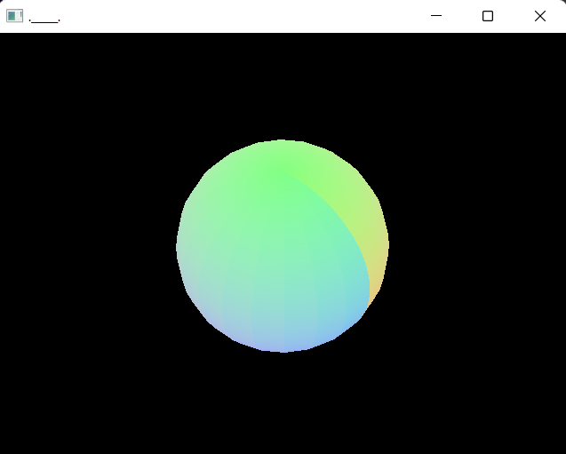

# OpenGL 3D Surface Plotter for Windows

This header-only C library plots parametric surfaces in 3D.
Check out this article I wrote for more information or to use my surface plotter web app.
https://stoned-ape.github.io/posts/plotter3d/


## Examples

### Plot a Sphere

```c
#include "plot_surface.h"
#include <math.h>

vec3 surf_sphere(vec2 uv,float t){
    return (vec3){
        .5*cosf(uv.x)*sinf(uv.y),
        .5*           cosf(uv.y),
        .5*sinf(uv.x)*sinf(uv.y)
    };
}

int main(){
	plot_surface(surf_sphere,(vec2){0,0},(vec2){2*pi,pi},20);
}
```


### Plot a Parabola

```c
vec3 surf_parabola(vec2 uv,float t){
    return (vec3){
        uv.x,
        uv.x*uv.x+uv.y*uv.y-.7,
        uv.y
    };
}

int main(void){
    plot_surface(surf_parabola,(vec2){-1,-1},(vec2){1,1},20);
}
```


### Plot a Torus
```c
vec3 surf_torus(vec2 uv,float t){
    float R=.7,r=.2;
    return (vec3){
        cosf(uv.x)*(R+r*sinf(uv.y)),
        r*cosf(uv.y),
        sinf(uv.x)*(R+r*sinf(uv.y)),
    };
}

int main(void){
    plot_surface(surf_torus,(vec2){0,0},(vec2){2*pi,2*pi},20);
}
```


See more examples in main.c.

## API
There is only one function to be concerned with.
```c
void plot_surface(vec3(*f)(vec2,float),vec2 uv0,vec2 uv1,int res);
```

* f: A user defined function that maps two parameters to a point on a 3D surface.  
	The library passed the the time of day in seconds in f's second parameter.  
	This is used for animated plots.
* uv0: The starting point for parameters u,v.
* uv1: The ending point for parameters u,v. 
* res: The vertical/horizontal resolution of the plot.  The number of vertecies is `res*res`.

## Build Instruction
You must have Visual Studio installed or download `make` and `clang` some other way.

Find the path to your windows .lib files.  In the makefile we have:
```bash
LIBDIR="C:/Program Files (x86)/Windows Kits/10/Lib/10.0.19041.0/um/x64/"
```
This may or may not be correct for your machine.  Your .libs should be in a similar place.

Open a visual studio developer command prompt or run your `vcvars64.bat` script in some other shell.
This will add `nmake` and `cl` (msvc) to your path.  Run `nmake` to build and `.\a.exe` to run. 

You can also build with `clang` if you have it installed.  Just uncomment the associated lines in the makefile.


